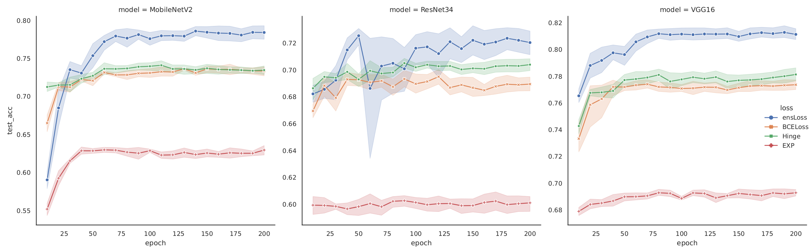
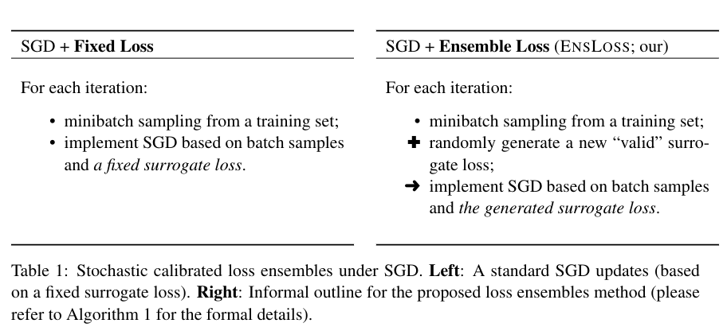
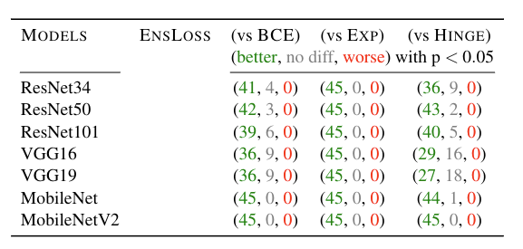
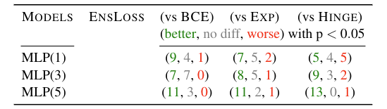

# 🔂 *EnsLoss*: Stochastic Calibrated Loss Ensembles for Preventing Overfitting in Classification 

[](http://twitter.com/share?text=ensloss&url=https://github.com/statmlben/ensLoss&hashtags=Loss,ERM,EnsembleLearning,MachineLearning,AI)
[](https://www.linkedin.com/shareArticle?mini=true&url=https://github.com/statmlben/ensLoss&title=ensloss)
[](https://www.python.org/)
[](https://github.com/statmlben/ensLoss/pulls)

Empirical risk minimization (ERM) with a computationally feasible surrogate loss is a widely accepted approach for classification. Notably, the surrogate loss is not arbitrary, typically requiring *convexity* and *calibration* (CC) properties to ensure consistency in maximizing accuracy.

In this project, we propose a novel loss ensemble method, namely **EnsLoss**, which extends the ensemble learning concept to combine losses within the ERM framework. Unlike existing ensemble methods, our method distinctively preserves the "*legitimacy*" of the combined losses, i.e., ensuring the CC properties.

- GitHub repo: [https://github.com/statmlben/ensloss](https://github.com/statmlben/ensloss)
- Paper: [arXiv:2409.00908](https://arxiv.org/abs/2409.00908)

This repo describes a set of experiments that demonstrate the performance of the proposed **EnsLoss** method compared with existing methods based on a *fixed loss function*, and also assess its *compatibility* with other regularization methods.

> **Quick overview.** Comparison of epoch-vs-test\_accuracy curves for various models on CIFAR2 (cat-dog) dataset using **EnsLoss** (ours) and other fixed losses (logistic (BCE), hinge, and exponential losses).
>
> 

## Motivation

### {ensemble + CC} losses in SGD
The primary motivation behind consists of two components: **ensemble** and the **calibration** (CC conditions) of the loss functions.



### CC losses | CC loss-derivatives

The key observation of SGD is that the *impact of the loss function $\phi$ on SGD is solely reflected in its loss-derivative $\partial \phi$*. We only need to generate the valid loss derivatives; refer to the following figure illustrating the transformation of the CC conditions of losses into loss-derivatives.


Hence, it allows us to bypass the generation of loss and directly generate the loss-derivatives in SGD, thereby inspires *doubly stochastic gradients* (i.e., random batch samples and random calibrated loss-derivatives) of our Algorithm.

## Overview of the Experiments

Different **loss functions** can be integrated with **various neural networks** and **regularization methods** to tackle the classification problem across **diverse datasets**. In order to compare the advantages of our proposed method, we have provided reproducible benchmark code and results in this repository.

This repository supports:

- **Data Modes**
  - [x] Image data ([main_img.py](./main_image.py))
  - [x] Tabular data ([main_tab.py](./main_tab.py))
  - [ ] Text data ([main_text.py](./main_text.py))

- **Loss** ([losses.py](./losses.py))
  - [x] `ensLoss` (our method)
  - [x] `BCELoss`: binary cross entropy
  - [x] `Hinge`: hinge loss
  - [x] `EXP`: exponential loss
  - [x] `BinFocal`: binary focal loss

- **Model** ([img_models](./img_models/) + [tab_models](./tab_models/) + [text_models](./text_models/))
  - [x] VGG: `VGG16`, `VGG19`
  - [x] ResNet: `ResNet18`, `ResNet34`, `ResNet50`, `ResNet101`, `ResNet152`
  - [x] MobileNet: `MobileNet`, `MobileNetV2`
  - [x] DenseNet: `DenseNet121`, `DenseNet161`, `DenseNet169`, `DenseNet201`
  - [x] TabMLP\{D\} with different depths `D=1,3,5`
  - [x] LSTM: `LSTM`, `BiLSTM`

- **Regularization methods**
  - [x] `dropout` in [ResNet](./img_models/resnet.py)
  - [x] `weight_decay`
  - [x] `data augumentation` in [CIFAR](./loader.py)

Our running results are publicly available in both our W&B projects and this GitHub repository.
- **W&B projects**
  - [x] [ensLoss-tab](https://wandb.ai/bdai/ensLoss-tab?nw=nwuserbdai)
  - [x] [ensLoss-img](https://wandb.ai/bdai/ensLoss-img?nw=nwuserbdai)
  - [x] [ensLoss-txt](https://wandb.ai/bdai/ensLoss-txt?nw=nwuserbdai)
- **Markdown reports**
  - [x] [out_tab](./out/out_tab.md)
  - [x] [out_cifar](./out/out_cifar.md)
  - [x] [out_pcam](./out/out_pcam.md)
  - [x] [out_text](./out/out_text.md)
  - [x] [out_reg](./out/out_reg.md)

## Benchmarks for Image Data

This benchmark contains two image datasets: [CIFAR10](https://www.cs.toronto.edu/~kriz/cifar.html) and [PCam](https://github.com/basveeling/pcam).

- **CIFAR.** The CIFAR10 dataset was originally designed for multiclass image classification. In our study, we construct (10 x 9) / 2 = 45 binary CIFAR datasets, denoted as CIFAR2, by selecting all possible pairs of two classes from the CIFAR10 dataset, which enables the evaluation of our method.
- **PCam.** The PCam dataset is an image binary classification dataset consisting of 327,680 96x96 color images derived from histopathologic scans of lymph node sections, with each image annotated with a binary label indicating the presence or absence of metastatic tissue.

### Replicating Benchmark
The summary statistics of datasets exhibiting statistical significance when comparing the proposed **ensLoss** against all other fixed loss methods in **45 CIFAR2** binary classification datasets are presented.

| **Models**       | **EnsLoss** | **(vs BCE)**                  | **(vs Exp)**                  | **(vs Hinge)**                |
|------------------|-------------|-------------------------------|-------------------------------|-------------------------------|
| **ResNet34**     |             | (41 better, 4 no diff, 0 worse) | (45 better, 0 no diff, 0 worse) | (36 better, 9 no diff, 0 worse) |
| **ResNet50**     |             | (42 better, 3 no diff, 0 worse) | (45 better, 0 no diff, 0 worse) | (43 better, 2 no diff, 0 worse) |
| **ResNet101**    |             | (39 better, 6 no diff, 0 worse) | (45 better, 0 no diff, 0 worse) | (40 better, 5 no diff, 0 worse) |
| **VGG16**        |             | (36 better, 9 no diff, 0 worse) | (45 better, 0 no diff, 0 worse) | (29 better, 16 no diff, 0 worse) |
| **VGG19**        |             | (36 better, 9 no diff, 0 worse) | (45 better, 0 no diff, 0 worse) | (27 better, 18 no diff, 0 worse) |
| **MobileNet**    |             | (45 better, 0 no diff, 0 worse) | (45 better, 0 no diff, 0 worse) | (44 better, 1 no diff, 0 worse) |
| **MobileNetV2**  |             | (45 better, 0 no diff, 0 worse) | (45 better, 0 no diff, 0 worse) | (45 better, 0 no diff, 0 worse) |

<!--  -->

To replicate the benchmark results presented in our paper, please use the following command:
```bash
bash ./sh_files/runs_cifar_mobilenet.sh
bash ./sh_files/runs_cifar_resnet.sh
bash ./sh_files/runs_cifar_vgg.sh
bash ./sh_files/runs_pcam.sh
```
Our runing results are publicly avaliable in our W\&B project [ensLoss-img](https://wandb.ai/bdai/ensLoss-img?nw=nwuserbdai) and the markdown report [out_cifar](./out/out_cifar.md) and [out_pcam](./out/out_pcam.md).

### Customize the Run
To execute the methods on a dataset, use the following command:
```bash
## run for CIFAR
python main_image.py -F="CIFAR35"
## run for PCam
python main_image.py -F="PCam"
```
> Note that `CIFAR{u}{v}` represents the pairwise CIFAR dataset containing labels {u} and {v}.

The runing configuration is included in `main_img.py`, with the default settings as follows:
```python
config = {
        'loss_list': ['ensLoss', 'Focal', 'BCE', 'Hinge', 'EXP'],
        'dataset' : 'CIFAR',
        'model': {'net': 'ResNet50'},
        'save_model': False,
        'batch_size': 128,
        'ensLoss_per_epochs': -1,
        'trainer': {'epochs': 200, 'val_per_epochs': 5},
        'optimizer': {'lr': 1e-3, 'type': 'SGD', 'weight_decay': 5e-4, 'lr_scheduler': 'CosineAnnealingLR', 'args': {'T_max': 200}},
        'device': torch.device("cuda:0" if torch.cuda.is_available() else "cpu")}
```
To customize your experiment, please adjust the parameters in `argument` and `config`.

> Note that the results regarding the compatibility of existing overfitting prevention methods in our paper can also be replicated with customized runs, see [main_reg.py](./main_reg.py).


## Benchmarks for Tabular Data

This benchmark contain 14 tabular datasets in [openml](https://www.openml.org/). These datasets were selected based on the following filtering criteria: `verified`, `>1000 instances`, `>1000 features`, `binary class`, `dense`, and with at least one official run. The resulting datasets can be found [here](https://www.openml.org/search?type=data&sort=runs&status=active&qualities.NumberOfInstances=between_1000_10000&qualities.NumberOfFeatures=between_1000_10000&qualities.NumberOfClasses=%3D_2&format=ARFF):

| **Dataset**       | **Data ID** | **(n,d) (× 10³)** |
|-------------------|-------------|-------------------|
| Bioresponse       | 4134        | (3.75, 1.78)      |
| guillermo         | 41159       | (20.0, 4.30)      |
| riccardo          | 41161       | (20.0, 4.30)      |
| hiva-agnostic     | 1039        | (4.23, 1.62)      |
| christine         | 41142       | (5.42, 1.64)      |
| OVA-Breast        | 1128        | (1.54, 10.9)      |
| OVA-Uterus        | 1138        | (1.54, 10.9)      |
| OVA-Ovary         | 1166        | (1.54, 10.9)      |
| OVA-Kidney        | 1134        | (1.54, 10.9)      |
| OVA-Lung          | 1130        | (1.54, 10.9)      |
| OVA-Omentum       | 1139        | (1.54, 10.9)      |
| OVA-Colon         | 1161        | (1.54, 10.9)      |
| OVA-Endometrium   | 1142        | (1.54, 10.9)      |
| OVA-Prostate      | 1146        | (1.54, 10.9)      |

### Replicating Benchmark
The summary statistics of datasets exhibiting statistical significance when comparing the proposed **ensLoss** against all other fixed loss methods in **14 OpenML** binary classification datasets are presented.

| **Models** | **EnsLoss** | **(vs BCE)**         | **(vs Exp)**         | **(vs Hinge)**       |
|------------|-------------|----------------------|----------------------|----------------------|
| **MLP(1)** |             | (9 better, 4 no diff, 1 worse) | (7 better, 5 no diff, 2 worse) | (5 better, 4 no diff, 5 worse) |
| **MLP(3)** |             | (7 better, 7 no diff, 0 worse) | (8 better, 5 no diff, 1 worse) | (9 better, 3 no diff, 2 worse) |
| **MLP(5)** |             | (11 better, 3 no diff, 0 worse) | (11 better, 2 no diff, 1 worse) | (13 better, 0 no diff, 1 worse) |

<!--  -->

To replicate the benchmark results presented in our paper, please use the following command:
```bash
bash ./sh_files/runs_tab.sh
```
Our runing results are publicly avaliable in our W\&B project [ensLoss-tab](https://wandb.ai/bdai/ensLoss-tab?nw=nwuserbdai) and the markdown report [out_tab](./out/out_tab.md).

### Customize the Run
To execute the methods on a dataset, use the following command:
```bash
python main_tab.py -ID=4134
```
Note that the `ID` refers to the dataset ID in OpenML. The runing configuration is included in `main_tab.py`, with the default settings as follows:

```python
config = {
        'dataset' : 4134,
        'model': {'net': 'TabMLP3', 'args': {}},
        'batch_size': 128,
        'save_model': False,
        'ensLoss_per_epochs': -1,
        'trainer': {'epochs': 300, 'val_per_epochs': 10},
        'optimizer': {'lr': 1e-4, 'type': 'SGD', 'weight_decay': 5e-6,
                        'lr_scheduler': 'CosineAnnealingLR', 'args': {'T_max': 300}},
        'device': torch.device("cuda:0" if torch.cuda.is_available() else "cpu")}
```
To customize your experiment, please adjust the parameters in `argument` and `config`.


## Benchmarks for Text Data
This benchmark contains one text datasets: [GLUE-SST2](https://huggingface.co/datasets/nyu-mll/glue).

> Currently, the majority of NLP learning employs fine-tuning (often just a few epochs) from large pretrained models. Consequently, `ensLoss` that require extensive epoch training, are not particularly suitable. Therefore, we did not focus on NLP results in this paper; however, we conducted some preliminary experiments.

To execute the methods on a dataset, use the following command:
```bash
python main_text.py -F="SST2"
```

The runing configuration is included in `main_text.py`, with the default settings as follows:
```python
config = {
        'dataset' : args.filename,
        'model': {'net': 'BiLSTM'},
        'save_model': False,
        'batch_size': 32,
        'ensLoss_per_epochs': -1,
        'trainer': {'epochs': 50, 'val_per_epochs': 5},
        'optimizer': {'lr': 2e-5, 'type': 'AdamW', 'weight_decay': 1e-5,
                        'lr_scheduler': 'CosineAnnealingLR', 'args': {'T_max': args.epoch}},
        'device': torch.device("cuda:0" if torch.cuda.is_available() else "cpu")}
```
To customize your experiment, please adjust the parameters in `argument` and `config`.

## References
- [OpenML](https://www.openml.org/)
- [Pytorch.data](https://pytorch.org/tutorials/beginner/basics/data_tutorial.html)
- [Train CIFAR10 with PyTorch](https://github.com/kuangliu/pytorch-cifar)
- [huggingface.transformers](https://huggingface.co/transformers/v3.3.1/index.html)
- [GLUE benchmark](https://gluebenchmark.com/leaderboard)
- [PS3E24: PyTorch Tabular Resnet](https://www.kaggle.com/code/syerramilli/ps3e24-pytorch-tabular-resnet)
