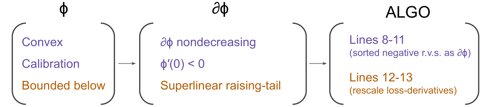

# 🔂 *EnsLoss*: Stochastic Calibrated Loss Ensembles for Preventing Overfitting in Classification

Empirical risk minimization (ERM) with a computationally feasible surrogate loss is a widely accepted approach for classification. Notably, the surrogate loss is not arbitrary, typically requiring *convexity* and *calibration* (CC) properties to ensure consistency in maximizing accuracy. 

In this project, we propose a novel loss ensemble method, namely **EnsLoss**, which extends the ensemble learning concept to combine losses within the ERM framework. Unlike existing ensemble methods, our method distinctively preserves the "*legitimacy*" of the combined losses, i.e., ensuring the CC properties.

This repo describes a set of experiments that demonstrate the performance of the proposed **EnsLoss** method compared with existing methods based on a *fixed loss function*, and also assess its *compatibility* with other regularization methods.

## Motivation

### {ensemble + CC} in SGD
The primary motivation behind consists of two components: **ensemble** and the **calibration** (CC conditions) of the loss functions.

| **SGD + Fixed Loss**                                       | **SGD + Ensemble Loss (EnsLoss; our)**                      |
|-----------------------------------------------------------|-------------------------------------------------------------|
| **For each iteration:**                                   | **For each iteration:**                                     |
| - Minibatch sampling from a training set;                | - Minibatch sampling from a training set;                  |
| - Implement SGD based on batch samples and a fixed       | - Randomly generate a new "**valid**" surrogate loss;         |
|   surrogate loss.                                        | - Implement SGD based on batch samples and the generated   |
|                                                           |   surrogate loss.                                          |

### CC losses | CC loss-derivatives

The key observation of SGD is that the *impact of the loss function $\phi$ on SGD is solely reflected in its loss-derivative $\partial \phi$*. We only need to generate the valid loss derivatives; refer to the following figure illustrating the transformation of the CC conditions of losses into loss-derivatives.



Hence, it allows us to bypass the generation of loss and directly generate the loss-derivatives in SGD, thereby inspires *doubly stochastic gradients* (i.e., random batch samples and random calibrated loss-derivatives) of our Algorithm.


## Results

In binary classification, different loss functions can be combined with various neural networks to solve the problem. In order to compare the advantages of our proposed method, we have provided reproducible benchmark code and results in this repository.

### Dependencies

For all benchmarks, it is necessary to install the following packages.

```bash
pip install pytorch
```

### Benchmarks for Tabular data

Benchmarks for Tabular data contain various dataset in [openml](https://www.openml.org/).

To run the benchmarks available use the following command:

```bash
python main_image.py -B=128 -e=200 -ID=43969 -R=3 --no-log
```
Note that `ID` is the `openml` dataset ID. 

The network config is included in `main_tab.py`, and the default setting is:

```python
    config = {
            'model': {'net': 'TabMLP5', 'args': {'H': 256}},
            'batch_size': args.batch,
            'trainer': {'epochs': args.epoch, 'val_per_epochs': 10}, 
            'optimizer': {'lr': 1e-4, 'type': 'Adam', 'lr_scheduler': 'ConstantLR', 'args': {'factor': 1./3, 'total_iters': 1}},
            'device': torch.device("cuda:0" if torch.cuda.is_available() else "cpu")}
```
If you need to switch networks, please modify the parameters in the config.


### Benchmarks for Image data

Benchmarks for Image data contain two dataset: [CIFAR10](https://www.cs.toronto.edu/~kriz/cifar.html) and [PCam](https://github.com/basveeling/pcam).

- We adopted the MHIST dataloader from (https://github.com/srinidhiPY/ICCV-CDPATH2021-ID-8). 

To run the benchmarks available use the following command:

```bash
## run for CIFAR
python main_image.py -B=128 -e=200 -F="CIFAR" -R=3 --no-log
## run for PCam
python main_image.py -B=128 -e=100 -F="PCam" -R=3 --no-log
```

The network config is included in `main_image.py`, and the default setting is:

```python
config = {
        'model': {'net': 'VGG', 'args': {'vgg_name': 'VGG19'}},
        'batch_size': args.batch,
        'trainer': {'epochs': args.epoch, 'val_per_epochs': 10}, 
        'optimizer': {'lr': 1e-3, 'type': 'SGD', 'lr_scheduler': 'CosineAnnealingLR', 'args': {'T_max': 200}},
        'device': torch.device("cuda:0" if torch.cuda.is_available() else "cpu")}
```
If you need to switch networks, please modify the parameters in the config.

### Model list

- ResNet18, ResNet34, ResNet50, ResNet101, ResNet152
- DenseNet121, DenseNet169, DenseNet201, DenseNet161
- MobileNet, MobileNetV2
- VGG11, VGG13, VGG16, VGG19

## References

- [Train CIFAR10 with PyTorch](https://github.com/kuangliu/pytorch-cifar)

## More obs


